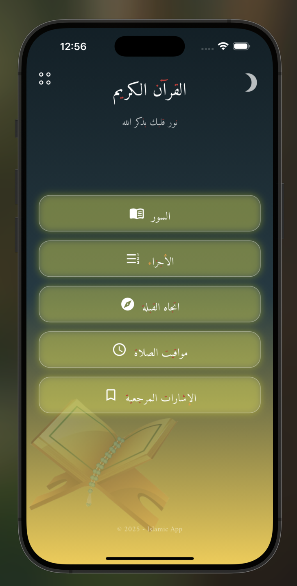
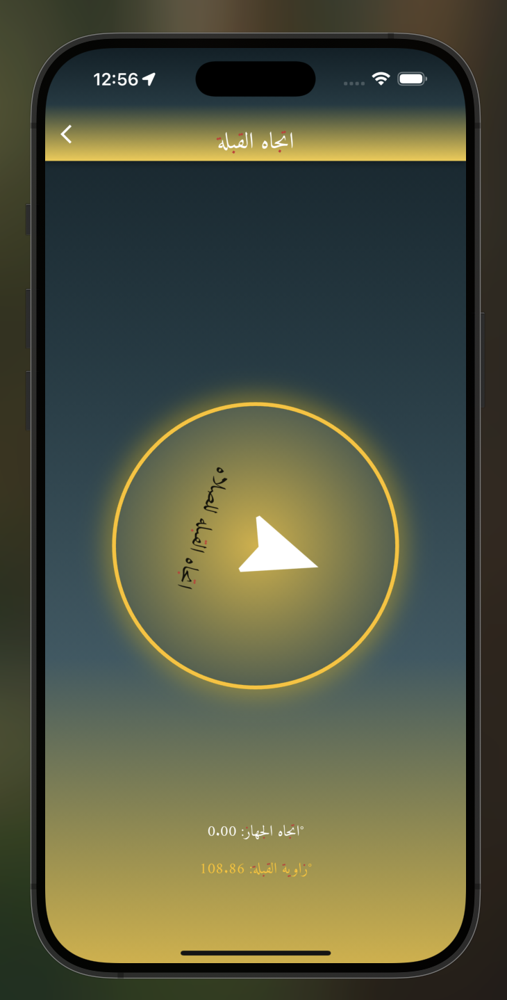
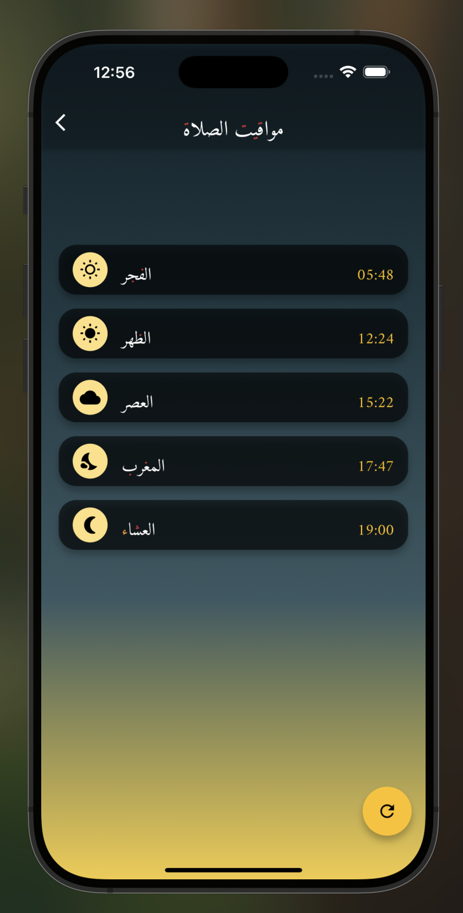
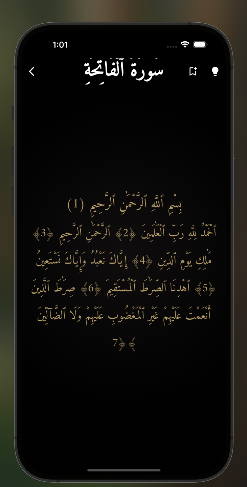
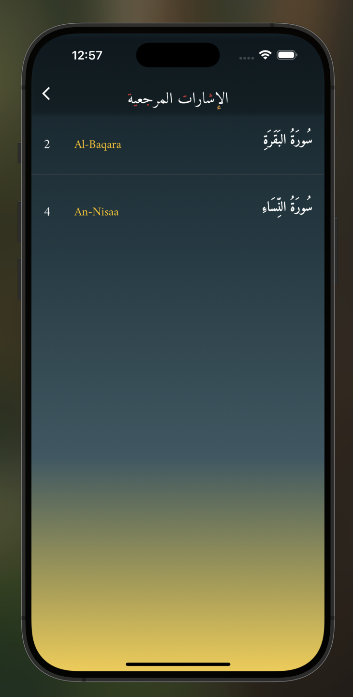
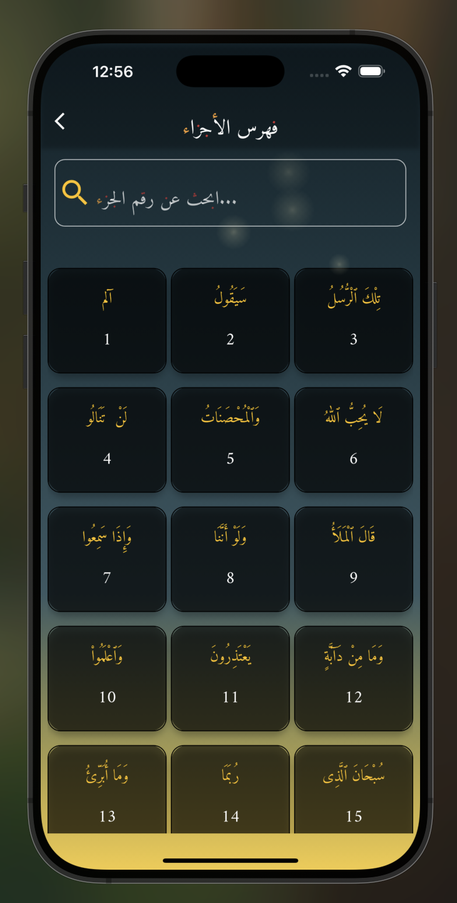

# Salahty - Your Ultimate Islamic Companion App

## 🕌 About Salahty
**Salahty** is a beautifully designed **Islamic lifestyle app** that helps Muslims stay connected to their faith through essential features such as **accurate prayer times, Azan notifications, Qibla direction, Quran reading, and more.** Whether you're at home or traveling, Salahty ensures that you never miss a prayer and always find the right direction for Qibla.

---

## 🌟 Features

### **🕋 Prayer Time & Azan Notifications**
- Automatically detects your **location** to provide **accurate prayer times** based on your timezone and geographical position.
- **Custom Azan reminders** with different call-to-prayer sounds.
- Get notified before and during prayer times.

### **🧭 Qibla Direction with Compass & Rotation**
- Use your device’s **compass and heading rotation** to accurately find the **Qibla direction**.
- Works anywhere in the world with precise calculations.

### **📖 Quran with Advanced Search & Bookmarks**
- Read the **entire Holy Quran** with a smooth and easy-to-use interface.
- **Search for any Surah** by name.
- **Search for Juz** to find specific sections quickly.
- **Bookmark your favorite verses** for quick access later.

### **📍 Location Detection for Precise Azan Time**
- **Automatic location detection** ensures the most **accurate prayer timings** based on **your city and country**.
- Uses a reliable **REST API** to fetch the latest prayer schedules.

### **💡 High-Quality User Experience**
- **Beautiful UI with 3D animations** for an immersive Islamic experience.
- Intuitive navigation that makes it easy for Muslims of all ages to use.
- **Dark mode and customization options** for a personalized look.

---

## 📸 App Screenshots

> _"A picture is worth a thousand words!"_

| Home Screen | Qibla Direction                    | Prayer Times                             |
|------------|------------------------------------|------------------------------------------|
|  |  |  |

| Quran Search                       | Bookmarks                                   | Azan Notification                     |
|------------------------------------|---------------------------------------------|---------------------------------------|
|  |  |  |

---

## 📥 Download & Test Salahty
We are inviting **beta testers** to try **Salahty App** and share feedback!

🔗 **[Download Salahty App from Firebase App Distribution](https://appdistribution.firebase.dev/i/3cf1a92d23a61792)**

---

## 👨‍💻 Developer Information
- **Developed by:** *Eng. Amr Alaa Ali*
- 📞 **Contact:** *+20 101 157 7033*
- 🌐 **More Projects Coming Soon!**

---

## 🛠️ Tech Stack & Tools
- **Flutter & Dart** (Cross-platform mobile development)
- **REST API** (Fetching real-time prayer times & location-based data)
- **Firebase** (App distribution & notifications)
- **Hive Database** (Local storage for Quran bookmarks & preferences)
- **3D Animations** (For smooth UI transitions & immersive experience)

---

## ⭐ Support & Feedback
We’d love to hear your feedback! If you have any **suggestions, bug reports, or feature requests**, feel free to contact us.

📩 **Email:** *[Your Email Here]*  
📱 **WhatsApp:** *+20 101 157 7033*

---

### 🙌 Thank You for Being a Part of the Salahty Community! May Allah bless you! 🌙✨

